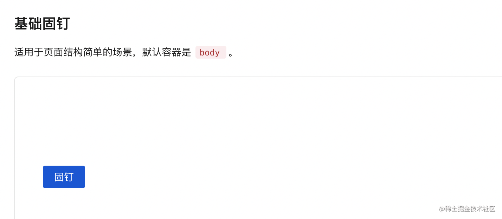

## 前言

下面的代码写的较为随意，完整代码点击
- [链接](https://github.com/lio-mengxiang/mx-design/tree/main/packages/mx-design-web/src/Affix)
- [demo实例](https://lio-mengxiang.github.io/mx-design/#/components/affix)

## 看完文章后，你是否能回答以下问题（文末有参考答案）

- 如果我们想要固定的组件，它的父容器是window，如何实现让一个div元素，定位到离浏览器视口上方150px的距离呢？

- 此时假如我们使用position: fixed固定组件，固定组件之前，这个组件是占据文档流的，但是fixed布局后脱离了文档流，所以就会出现塌陷问题，如何解决？

- 如果我们想要固定的组件，它的父容器是指定的dom元素，在我们的组件里用哪个api获取外界传入的

## 基本原理


如下图，这是一个按钮（内容为"固钉"），我希望在离屏幕150px的时候固定住它。



这里我们不考虑按钮在另一个容器的情况，简单说下原理。

首先，元素本身是在文档流的，然后固定住，就是position变为fixed了，所以我们只要在浏览器滚动的时候，监听onScroll事件，并且在事件里判断，是否按钮的getBoundingClientRect()中（getBoundingClientRect()用于获得页面中某个元素的左，上，右和下分别相对浏览器视窗的位置），是否top小于等于150px。

如果是的话，就把按钮的style属性变为position：fixed，然后top: 150px即可

然后，如果你采用了fixed定位，那么元素就脱离文档流了，所以我们需要加一个元素，宽高等于按钮的宽高，插入到按钮原来的位置，撑开文档流。等发现元素top大于150px的时候，再把这个元素删除（dom api 删除和添加元素）。

我们先用这个思路实现一版，最后考虑按钮如果在另一个能滚动的容器里该怎么办。

## 代码实现

首先我们看下dom结构
```
const Affix = forwardRef<AffixRef, AffixProps>((props, ref) => {
  const {
    children,
    className,
  } = props;

  const affixRef = useRef<HTMLDivElement>(null);
  const affixWrapRef = useRef<HTMLDivElement>(null);

  return (
    <div ref={affixWrapRef} className={className} style={style}>
      <div ref={affixRef}>{children}</div>
    </div>
  );
});
```
其中affixWrapRef是用来使用getBoundingClientRect()来获取到浏览器窗口顶部的top值，也用来添加占位元素，直接使用

```javascript
affixWrapRef.current.appendChild(占位元素)
```
affixRef是用来改变定位的，类似
```javascript
// 定位
affixRef.current.className = 固定的class，比如position：fixed;
affixRef.current.style.top = 固定的top;
```

好了，接着我们加入监听的代码，首次监听一定是在useEffect里

```javascript
const Affix = forwardRef<AffixRef, AffixProps>((props, ref) => {
  const {
    children,
    zIndex, // 固钉定位层级，样式默认为 500
    container, // 指定滚动的容器。数据类型为 String 时，会被当作选择器处理，进行节点查询。示例：'body' 或 () => document.body
    offsetBottom, // 距离容器顶部达到指定距离后触发固定
    offsetTop, // 距离容器底部达到指定距离后触发固定
    className,
    style,
    onFixedChange, // (affixed: boolean, context: { top: number }) => void 固定状态发生变化时触发
  } = props;


  const affixRef = useRef<HTMLDivElement>(null);
  const affixWrapRef = useRef<HTMLDivElement>(null);
  // 占位符的ref，用来创建占位的dom元素
  const placeholderEL = useRef<HTMLElement>(null);
  // 滚动容器的ref，默认是window
  const scrollContainer = useRef<ScrollContainerElement>(Window);

  // 它是用来处理滚动时，判断是否需要固定组件的函数
  const handleScroll = useCallback(() => {
       // xxx 后面会讲这里的逻辑
  }, [classPrefix, offsetBottom, offsetTop, onFixedChange, zIndex]);

  useImperativeHandle(ref, () => ({
    handleScroll,
  }));

  useEffect(() => {
    // 创建占位节点
    placeholderEL.current = document.createElement('div');
  }, []);

  useEffect(() => {
    // 这里可以看到首次加载Affix组件，会执行一下handleScroll，它是用来处理滚动时，判断是否需要固定组件的函数
    if (scrollContainer.current) {
      handleScroll();
      scrollContainer.current.addEventListener('scroll', handleScroll);
      window.addEventListener('resize', handleScroll);

      return () => {
        scrollContainer.current.removeEventListener('scroll', handleScroll);
        window.removeEventListener('resize', handleScroll);
      };
    }
  }, [container, handleScroll]);

  return (
    <div ref={affixWrapRef} className={className} style={style}>
      <div ref={affixRef}>{children}</div>
    </div>
  );
});

```
这里就有一个问题了，为啥在绑定scroll事件的时候，要提前调用一下handleScroll方法呢，因为可能首次加载就满足元素被固定的条件了，比如距离浏览器顶部150px的时候固定，首次加载完Affix组建后就正好是150px。

## 组件最核心的handleScroll逻辑

```javascript
const Affix = forwardRef<AffixRef, AffixProps>((props, ref) => {
  const {
    children,
    zIndex, // 固钉定位层级，样式默认为 500
    container, // 指定滚动的容器。数据类型为 String 时，会被当作选择器处理，进行节点查询。示例：'body' 或 () => document.body
    offsetBottom, // 距离容器底部达到指定距离后触发固定
    offsetTop, // 距离容器顶部达到指定距离后触发固定
    className,
    style,
    onFixedChange, // (affixed: boolean, context: { top: number }) => void 固定状态发生变化时触发
  } = props;

  const { classPrefix } = useConfig();

  const affixRef = useRef<HTMLDivElement>(null);
  const affixWrapRef = useRef<HTMLDivElement>(null);
  const placeholderEL = useRef<HTMLElement>(null);
  const scrollContainer = useRef<ScrollContainerElement>(null);

  const ticking = useRef(false);

  const handleScroll = useCallback(() => {
    if (!ticking.current) {
      window.requestAnimationFrame(() => {
        // top 是固定包裹元素affixWrapRef到浏览器视口顶部的距离，不包括margin
        // width是元素的宽,不包含margin
        // height是元素的搞,不包含margin
        const {
          top: wrapToTop = 0,
          width: wrapWidth = 0,
          height: wrapHeight = 0,
        } = affixWrapRef.current?.getBoundingClientRect() ?? { top: 0 };


        const calcTop = wrapToTop  节点顶部到 container 顶部的距离
        // 整个视口的高减去元素的高
        const containerHeight =
          scrollContainer.current['innerHeight'] -
          wrapHeight;

        const calcBottom = containerHeight  - (offsetBottom ?? 0); // 计算 bottom 相对应的 top 值

        // 这里是固定的关键代码，fixedTop表示是否此时处于固定状态
        let fixedTop: number | false;
        // offsetTop，也就是外部传入的，我想元素距离浏览器顶部多远的时候固定
        // 当offsetTop存在，并且calcTop（节点顶部到 container 顶部的距离）小于我们设置的offsetTop
        // 这时候就需要固定
        if (offsetTop !== undefined && calcTop <= offsetTop) {
          // top 的触发
          fixedTop = containerToTop + offsetTop;

          // 下面这一行if判断的意思是，我们外部传入offsetBottom = 20的话
          // 就是希望在元素距离浏览器视口顶部20px的时候固定住
          // 所以wrapToTop，也就是元素距离浏览器视口顶部的距离，大于calcBottom的时候，
          // calcBottom是指浏览器视口的高度减去元素本身的高度，再减去offsetBottom，此时，就是元素到浏览器视口顶部剩余的高度了
          // 剩余的高度如果wrapToTop比它还大，那肯定就要固定住了呗
        } else if (offsetBottom !== undefined && wrapToTop >= calcBottom) {
          // bottom 的触发
          fixedTop = calcBottom;
        } else {
          fixedTop = false;
        }

        // 这里是处理固定时加入position: fixed的代码
        // 以及在fixed时候插入占位元素的
        if (affixRef.current) {
          // 判断当前是否需要固定状态
          const affixed = fixedTop !== false;
          // 判断此时是否已经把占位元素插入进去了
          const placeholderStatus = affixWrapRef.current.contains(placeholderEL.current);

          // 如果当前需要处于固定状态
          if (affixed) {
            // 定位，这里的className主要就是position：fixed
            affixRef.current.className = `${classPrefix}-affix`;
            affixRef.current.style.top = `${fixedTop}px`;
            affixRef.current.style.width = `${wrapWidth}px`;
            affixRef.current.style.height = `${wrapHeight}px`;

            // 设置z-Index
            if (zIndex) {
              affixRef.current.style.zIndex = `${zIndex}`;
            }

            // 插入占位节点
            if (!placeholderStatus) {
              placeholderEL.current.style.width = `${wrapWidth}px`;
              placeholderEL.current.style.height = `${wrapHeight}px`;
              affixWrapRef.current.appendChild(placeholderEL.current);
            }
          } else {
            affixRef.current.removeAttribute('class');
            affixRef.current.removeAttribute('style');

            // 删除占位节点
            placeholderStatus && placeholderEL.current.remove();
          }

          // 触发onFixedChange，这里其实腾讯的T-deisgn实现的有问题，可以去提pr了，因为它应该判断当前fiexd的值是否跟上一次的不一样，那么说明fixed的情况发生变化了
          if (isFunction(onFixedChange)) {
            onFixedChange(affixed, { top: +fixedTop });
          }
        }

        ticking.current = false;
      });
    }
    ticking.current = true;
  }, [classPrefix, offsetBottom, offsetTop, onFixedChange, zIndex]);

  useImperativeHandle(ref, () => ({
    handleScroll,
  }));

  useEffect(() => {
    // 创建占位节点
    placeholderEL.current = document.createElement('div');
  }, []);

  useEffect(() => {
    scrollContainer.current = getScrollContainer(container);
    if (scrollContainer.current) {
      handleScroll();
      scrollContainer.current.addEventListener('scroll', handleScroll);
      window.addEventListener('resize', handleScroll);

      return () => {
        scrollContainer.current.removeEventListener('scroll', handleScroll);
        window.removeEventListener('resize', handleScroll);
      };
    }
  }, [container, handleScroll]);

  return (
    <div ref={affixWrapRef} className={className} style={style}>
      <div ref={affixRef}>{children}</div>
    </div>
  );
});

Affix.displayName = 'Affix';
Affix.defaultProps = affixDefaultProps;

export default Affix;

```
最后，我们把容器如果不是Window的情况处理一下,在handleScroll函数中


```javascript
const {
          top: wrapToTop = 0,
          width: wrapWidth = 0,
          height: wrapHeight = 0,
        } = affixWrapRef.current?.getBoundingClientRect() ?? { top: 0 };

        // 这里加入containerToTop，表示固定元素外部容器，距离浏览器顶部的高度
        // 因为固定元素是在这个容器里被固定，所以只能获取到
        let containerToTop = 0;
        if (scrollContainer.current instanceof HTMLElement) {
          containerToTop = scrollContainer.current.getBoundingClientRect().top;
        }

        // 这里需要你思考一下为啥有了容器，距离顶部的距离就是 wrapToTop - containerToTop
        const calcTop = wrapToTop - containerToTop; // 节点顶部到 container 顶部的距离
        // 如果是有容器的情况，就不能用innerHeight API了，只有window才有，所以可以用clientHeight来得到容器的高度
        const containerHeight =
          scrollContainer.current[scrollContainer.current instanceof Window ? 'innerHeight' : 'clientHeight'] -
          wrapHeight;

        // 这里其实很简单，原来我们用  containerHeight - (offsetBottom ?? 0)获取到容器是Window的情况
        // 现在改为其他容器，是不是只要加上containerToTop，也就是容器到浏览器视口顶部的高度就行了，哈哈

        const calcBottom = containerToTop + containerHeight - (offsetBottom ?? 0); // 计算 bottom 相对应的 top 值

```
