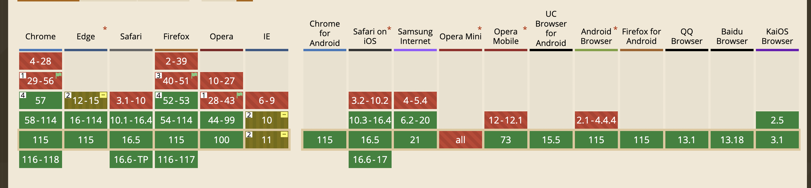
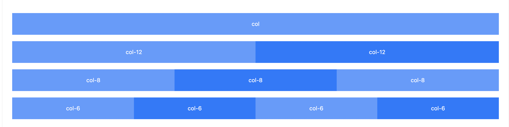
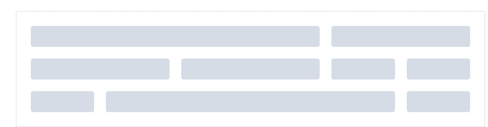
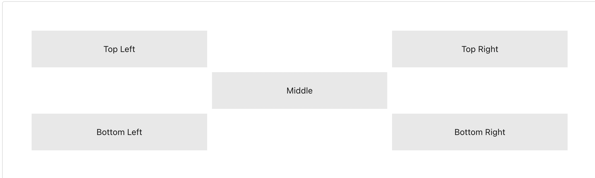
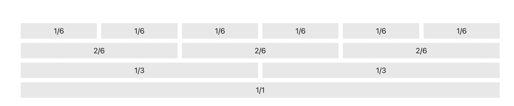
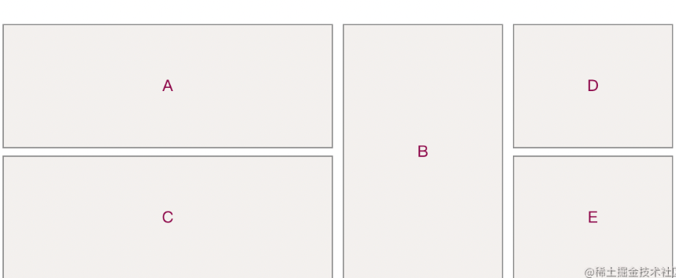
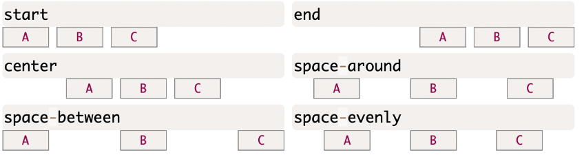

## 前言

- [本文组件github地址](https://github.com/lio-mengxiang/mx-design/tree/main/packages/mx-design-web/src/GridLayout)
- [本文demo](https://lio-mengxiang.github.io/mx-design/#/components/gridLayout)

## 为什么我们需要这样的组件

现在国内国外主流B端react组件库都会有一个叫布局的组件，在国内基本上有两个组件去实现布局功能：
- Grid 栅格布局组件
- Layout 布局组件

是因为早期浏览器对grid布局的兼容性并不好，所以这些库基本上都使用flex布局去实现复杂的二维布局。

但是今天gird布局兼容性良好，如下图



并且显然grid布局在处理更复杂的二维布局时，是远远超过flex的。这也是它出现的原因。所以我的react ui组件库直接使用了GridLayout组件代替了传统国内组件库的上述两个组件（Grid and Layout）。


### ant design 的布局组件示例如下：


### element plus 布局组件示例如下：



用过的同学都知道，这些组件主要是帮助我们布局的，并且可以设置在不同屏幕尺寸下布局的样式。

假如我们要布局成如下样式，以上的布局组件实现起来比较麻烦，不妨你们尝试一下：


开始用flex写了一版，总感觉代码非常不优雅，条件判断很多，后来一想，我们是新项目，不兼容ie的，为啥不用grid布局呢，但是grid布局纯写css并不难，怎么把其封装成一个通用组件，并且使用起来要:

### 替代antd的grid组件！ element plus 的layout组件！

问题就来了，市面上通用组件库都没这个组件啊，咋办，手写呗。参考开源项目 styled-css-grid，咋们用react函数式组件实现，并附有在线案例。因为代码只涉及到css封装，vue也可以借鉴然后封装自己的超强布局组件。

代码很优雅，只有两个文件。先看效果，以下所有效果在文章开头的demo示例里都有：

案例一（这个案例的目的是说明我们组件具备子元素偏移的能力）：



```JAVASCRIPT
import { GridLayout, Cell, Button } from '@mx-design/web';

function App() {
  const cellStyle = { background: "var(--bg-color-component)", padding: '20px 0' };
  return (
    <GridLayout columns={3}>
      <Cell style={cellStyle} middle>Top Left</Cell>
      <Cell left={3} style={cellStyle} middle>Top Right</Cell>
      <Cell left={2} top={2} style={cellStyle} middle>Middle</Cell>
      <Cell top={3} style={cellStyle} middle>Bottom Left</Cell>
      <Cell top={3} left={3} style={cellStyle} middle>Bottom Right</Cell>
    </GridLayout>
  )
}
```
案例2（这个案例说明我们的组件有任意分隔栅格布局的能力）：



```javascript
import { GridLayout, Cell, Button } from '@mx-design/web';

function App() {
  const cellStyle = { background: "var(--bg-color-component)", padding: '4px 0' };
  return (
      <GridLayout columns={6}>
        <Cell style={cellStyle} width={1} middle>1/6</Cell>
        <Cell style={cellStyle} width={1} middle>1/6</Cell>
        <Cell style={cellStyle} width={1} middle>1/6</Cell>
        <Cell style={cellStyle} width={1} middle>1/6</Cell>
        <Cell style={cellStyle} width={1} middle>1/6</Cell>
        <Cell style={cellStyle} width={1} middle>1/6</Cell>
        <Cell style={cellStyle} width={2} middle>2/6</Cell>
        <Cell style={cellStyle} width={2} middle>2/6</Cell>
        <Cell style={cellStyle} width={2} middle>2/6</Cell>
        <Cell style={cellStyle} width={3} middle>1/3</Cell>
        <Cell style={cellStyle} width={3} middle>1/3</Cell>
        <Cell style={cellStyle} width={6} middle>1/1</Cell>
      </GridLayout>
  )
}
```

案例三（代表我们组件具有奇形怪状的能力）：


当然我们也具备本身flex的左对齐，右对齐，中间对齐这些功能：



## flex布局并不过时，只是跟grid适用场景不同

如果你需要一些处理稍微复杂的二维布局场景，grid布局显然是目前最强的css布局方式，但是平时我们的业务相对简单，能使用flex布局解决的，并不需要使用grid的布局。

为什么我们要封装一个这样的组件，是因为上面所说的一些react ui库，使用flex布局实现栅格化的效果，但实现的相对复杂，是因为早期浏览器对grid布局的兼容性并不好。

既然现在不存在兼容性问题，为什么不用原生的css来实现栅格化布局呢？
